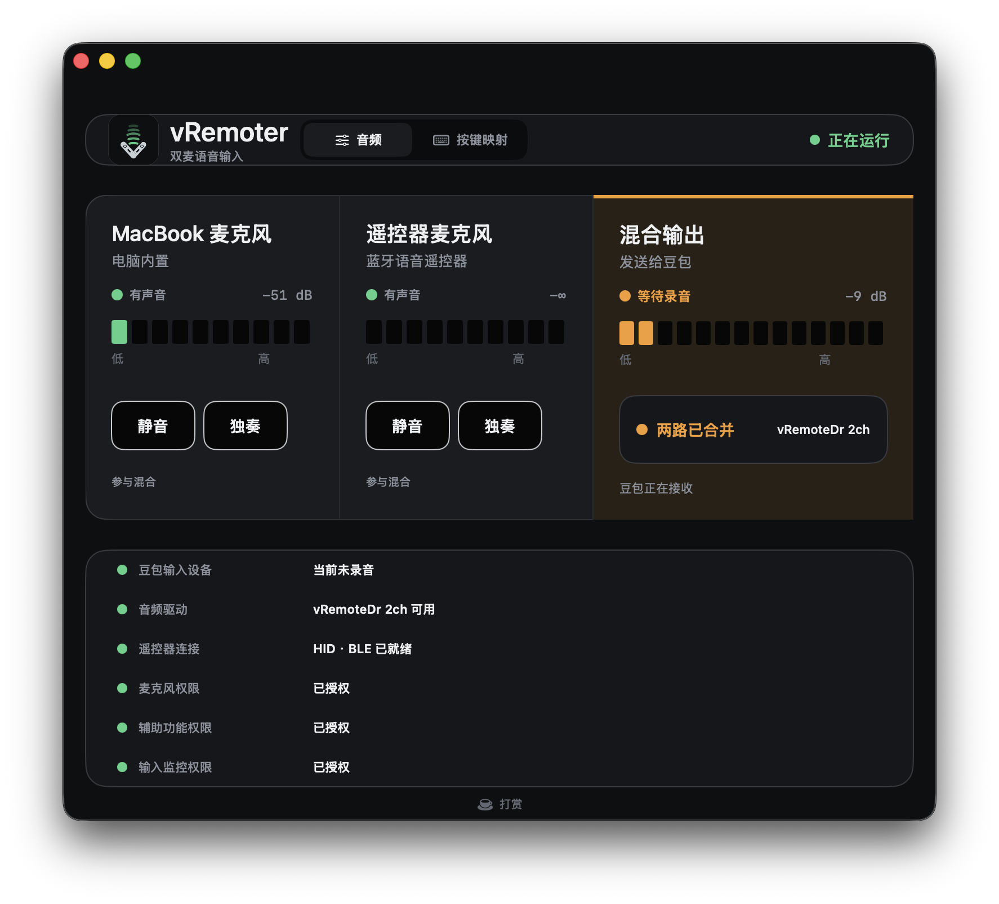
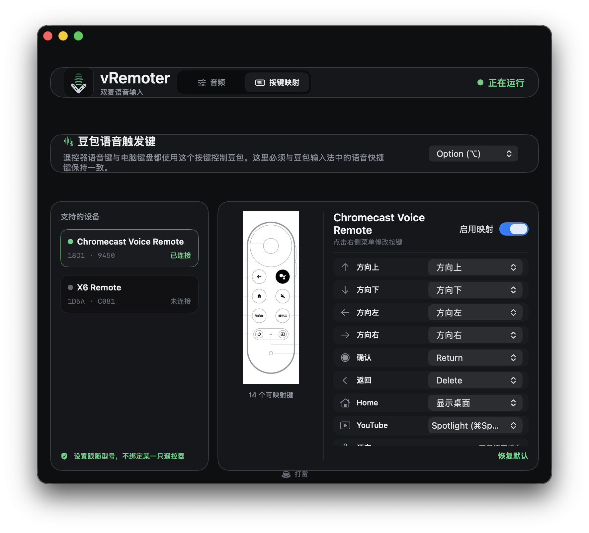

# vRemoter

> 本仓库保存 vRemoter 的源码、设计源稿、构建脚本与测试。普通用户请通过 `vincentstudio.org` 系列域名访问官网、下载与更新服务。

[官方网站](https://vremoter.vincentstudio.org/) · [下载最新版](https://updates.vincentstudio.org/vremoter/) · [v1.1.1 Release](https://github.com/VincentKingHsu/vRemoter/releases/tag/v1.1.1)

## 产品定位

vRemoter 把蓝牙语音遥控器变成 macOS 上的 Vibe Coding 控制器：遥控器语音键控制豆包输入法，遥控器麦克风与 MacBook 麦克风混合为同一个 CoreAudio 输入设备 `vRemoteDr 2ch`。

已接入的遥控器：

- X6-Remote（VID `0x1D5A` / PID `0xC081`）
- Google Chromecast Remote（VID `0x18D1` / PID `0x9450`）

Chromecast Remote 已实现语音键双模式：短按第一次打开、第二次关闭；长按时持续录音，松手自动关闭。APP 还提供按型号保存的按键映射，可把方向、确认、返回、Home、YouTube、Netflix、信源、音量等按键改为常用 macOS 操作。

当前版本：`1.1.1`

## 1.1.1 修复

- 修复 Chromecast Voice Remote 使用一段时间后，短按偶尔只打开豆包、遥控器麦克风却未持续收音的问题。
- 修复电脑 Option 关闭豆包时，较晚到达的音频状态可能短暂重新开启遥控器音频的问题。
- 改进双遥控器同时连接时的会话隔离、开麦确认与有限重试。
- 修复 X6 第一次短按开麦可能被误判为旧音频事件的问题。
- 更新按键映射页中的 Chromecast Remote 产品图。

## 1.1.0 新功能

- 新增 Chromecast Voice Remote（VID `0x18D1` / PID `0x9450`）语音与按键支持。
- 新增 X6 Remote 与 Chromecast Voice Remote 按键映射页面。
- 豆包语音触发键可选择 Option、Command、Control、Shift 或 Fn，默认 Option；所选按键必须与豆包输入法设置一致。
- 映射设置跟随型号，不绑定某一只遥控器；更换同型号设备后继续沿用。
- 启用映射后拦截设备原始动作，再由 vRemoter 发送所选键盘、媒体键或自定义快捷键；关闭映射即可恢复系统原行为。
- 主控制台去掉 X6 专属措辞，X6 与 Chromecast Remote 可以同时连接。





完整历史见 [CHANGELOG.md](CHANGELOG.md)。

当前支持边界：Chromecast 仅确认上述 VID/PID；X6 鼠标模式切换键由设备固件内部处理，不能单独重映射。语音键保留给豆包语音控制。Fn 的实际行为取决于 Mac 与豆包配置，建议首次使用时现场测试。

## 支持开发

vRemoter 免费提供。制作不易，麻烦打个赏补偿一点我的 Token 费吧。谢主隆恩🙏🙏🙏～～～

| 微信 / WeChat | 支付宝 / Alipay | PayPal |
|---|---|---|
|  |  |  |

## 仓库与公开服务边界

| 内容 | 位置 | 是否公开 |
|---|---|---|
| APP、驱动构建、测试与设计 | 本 GitHub 仓库 | 是 |
| 官网静态源文件 | `docs/` | 是，部署结果见官网 |
| 官网 | [vremoter.vincentstudio.org](https://vremoter.vincentstudio.org/) | 是 |
| 更新、PKG/DMG、购买配置 | [updates.vincentstudio.org/vremoter](https://updates.vincentstudio.org/vremoter/) | 是 |
| 原始宣传视频与市场素材 | 仓库外 `../marketing/` | 否，不上传 Git |

遥控器相关 GitHub 仓库：

- [VincentKingHsu/vRemoter](https://github.com/VincentKingHsu/vRemoter)
- [VincentKingHsu/x6-remote-voice-bridge](https://github.com/VincentKingHsu/x6-remote-voice-bridge)
- [VincentKingHsu/MiRemoteVoice](https://github.com/VincentKingHsu/MiRemoteVoice)

## 目录

- `Sources/vRemote/`：APP 主程序、BLE/ATVV、双麦混音、UI、更新与购买配置。
- `Driver/`：生成 `vRemoteDriver.driver` 的实验性构建脚本。
- `Packaging/`：APP 元数据、本地化与 PKG 安装脚本。
- `Resources/`：APP 内置权限向导、商业入口与支持开发图片。
- `SelfTests/`：硬件协议与更新配置回归数据。
- `Design/`：冻结 UI 和 Logo 的 Figma 本地插件源稿。
- `docs/`：公开官网静态源文件。
- `Server/`：马来西亚服务器配置与发布清单模板。
- `OPERATIONS.md`：从构建到上线和回滚的操作手册。

## 构建

```bash
./run-self-tests.sh
./package-app.sh
./build-pkg.sh
./build-dmg.sh
```

- `PKG`：首次安装或驱动发生变化时使用，包含 APP 与音频驱动。
- `DMG`：仅更新 APP，适合已经安装过驱动且本次驱动未变化的用户。

1.1.1 的驱动没有变化：PKG 供首次安装，DMG 供已经安装过驱动的用户覆盖更新。当前发布包尚未完成 Developer ID 签名与公证，下载页必须明确标注这一状态；正式广泛分发前仍须完成签名、公证与真实机器安装验证。

## 更新策略

APP 从以下地址读取版本清单：

`https://updates.vincentstudio.org/vremoter/releases.json`

- 普通 APP 更新：清单中同时提供 DMG/PKG，APP 自动优先下载 DMG。
- 驱动更新：将 `driver_update_required` 设为 `true`，APP 强制下载 PKG。
- 首次安装：官网始终推荐 PKG。

购买链接从以下地址动态读取：

`https://updates.vincentstudio.org/vremoter/commerce.json`

修改公开配置即可控制购买入口，不需要重新发布 APP。没有启用且有效的购买链接时，APP 会隐藏“购买遥控器”按钮。

## 发布前阻断项

1. 当前驱动是对 BlackHole GPL v3 二进制的修改构建。公开分发前必须选择：提供驱动对应源码与构建材料，或取得适用于闭源分发的商业授权。
2. APP、驱动与 PKG/DMG 尚需 Developer ID 签名和 notarization。
3. 每次发布都要验证首次 PKG 安装、DMG 覆盖更新、自动检查更新、购买链接刷新和卸载/回滚。

## 相关文档

- [完整发布与服务器运维手册](OPERATIONS.md)
- [第三方许可说明](THIRD_PARTY_NOTICES.md)
- [音频驱动说明](Driver/README.md)
- [冻结 UI 说明](Design/vRemoter-UI-v1-Frozen/UI-FREEZE.md)
