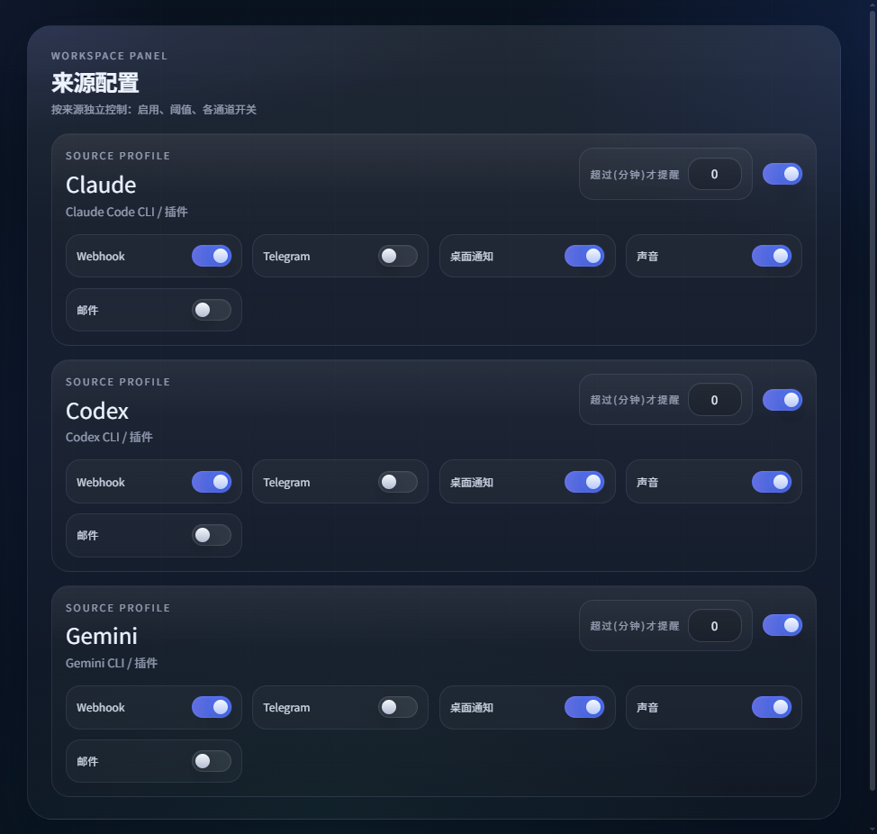
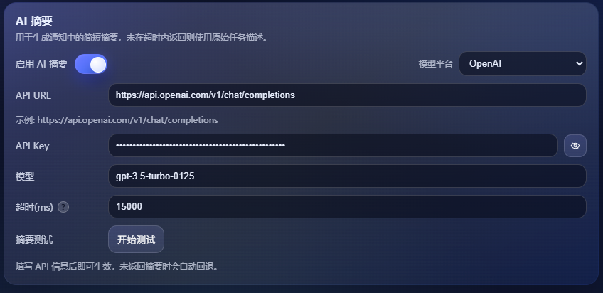
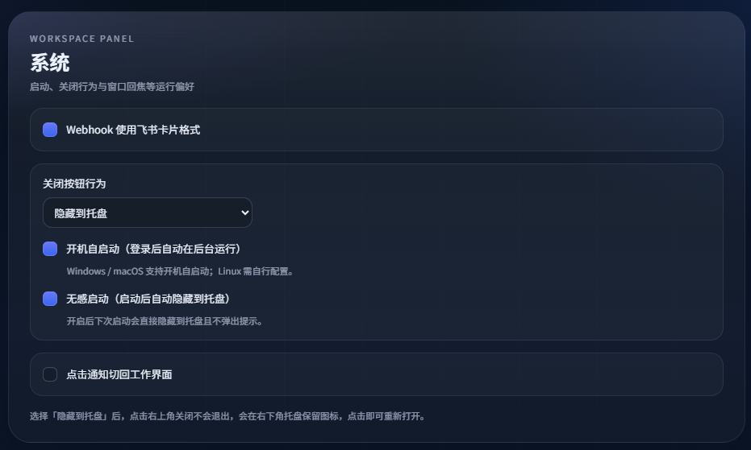

<div align="center">


# AI CLI Complete Notify (v2.8.0)


[English](README.md) | 简体中文 | [繁體中文](README_zh-TW.md) | [한국어](README_ko.md) | [日本語](README_ja.md)


</div>

### 📖 简介

面向 Claude Code / Codex / OpenCode / Gemini 的智能任务完成提醒工具，支持多种通知渠道和灵活的配置选项。当 AI 助手完成长时间任务时，自动通过多种方式通知您，让您无需守在电脑前等待。

**支持的通知方式：**

📱 Webhook（飞书/钉钉/企业微信）• 💬 Telegram Bot • 📧 邮件（SMTP）

🖥️ 桌面通知 • 🔊 声音/TTS 提醒 • ⌚ 手环/手表提醒（通过现有通知链路间接接入）


## ✨ 核心特性（更多详细更新日志见文末）

- 🎯 **智能去抖**：根据任务类型自动调整提醒时机，有工具调用时等待 60 秒，无工具调用时仅需 15 秒
- 🔀 **分源控制**：Claude / Codex / OpenCode / Gemini 独立启用与阈值设置
- 📡 **多通道推送**：同时支持多种通知方式，确保消息送达
- ⏱️ **耗时阈值**：只在任务超过设定时长时提醒，避免频繁打扰
- 🪝 **Hooks + Watch 混合集成**：Claude Code / Gemini CLI 可走原生 Hook，OpenCode 可走全局插件事件，Codex 继续通过日志监听完成提醒
- 🧠 **AI 摘要（可选）**：任务完成后快速生成简短摘要，超时自动回退
- 🖥️ **桌面应用**：图形界面配置，支持中英文切换、托盘隐藏、开机自启
- 🔐 **配置分离**：运行配置与敏感信息分离，安全可靠

## 💡 推荐配置

**重要提示**：为了获得最佳使用体验，建议在使用 Claude Code / Codex / OpenCode / Gemini 时授予 AI 助手**完整的文件读写权限**。

这样做的好处：
- ✅ 确保任务日志被正确记录到本地文件
- ✅ 监听功能能够准确捕获任务完成状态
- ✅ 提醒时机更加精准，避免误报或漏报
- ✅ AI 可以更好地管理项目文件和配置

## 注意事项

- Claude Code 往往会拆分为多个子任务，为避免每个子任务都提醒，本项目只在“整轮完成”后再通知。
- 监听模式依赖日志变化，需要一个去抖静默时间确认结束，因此提醒不是即时触发（默认有工具调用时 60 秒、无工具调用时 15 秒）。
- 如果想要更快、更干净的提醒：Claude Code / Gemini CLI 优先使用 Hook，OpenCode 优先使用全局插件；Codex 或其他兜底场景继续使用 Watch。

## Hooks 与 Watch 的区别

- **Hook / 插件事件** 直接利用 AI CLI 自己发出的显式生命周期事件。对 Claude Code、Gemini CLI 和 OpenCode 来说，这意味着提醒可以更接近真实完成时刻，而不是依赖静默时间去猜测。
- **Hook** 不需要为这些工具长期常驻一个后台监听器，空闲期开销更小，也更不容易因为日志解析产生误判。
- **Watch** 仍然是通用兜底方案。它很适合 Codex，也适合没有配置 Hook 的场景，但它必须依赖本地日志和去抖静默时间来推断一轮是否真正结束。
- 实际上，之所以增加 Hook / 插件事件选项，主要是因为 Claude Code 的 `Stop`、Gemini CLI 的 `AfterAgent`，以及 OpenCode 的 `session.idle` / `session.error`，相比日志轮询能提供更及时、更准确的完成信号；而在当前集成里，Codex 仍以 Watch 作为主要完成提醒路径。

## 🚀 快速开始

### Windows 用户

1. 从 [Releases](https://github.com/ZekerTop/ai-cli-complete-notify/releases) 下载最新的 `ai-cli-complete-notify-<版本号>-portable-win-x64.zip`
2. 压缩包解压后放到任意目录（如 `D:\Tools\`）
3. 复制 `.env.example` 为 `.env`，按照里面的要求填写通知配置
4. 双击运行桌面应用

### macOS / Linux 用户

源码 / 开发模式需要 Node.js/npm 和 Rust/Cargo。Tauri 在执行 `npm run dev` 时会调用 `cargo`；如果 `cargo --version` 失败，请先从 [Rust 官方安装页面](https://www.rust-lang.org/tools/install) 安装 Rust。

```bash
# 克隆仓库
git clone https://github.com/ZekerTop/ai-cli-complete-notify.git
cd ai-cli-complete-notify

# 确认 Rust/Cargo 可用
cargo --version

# 安装依赖
npm install

# 配置环境变量（源码开发模式）
cp .env.example .env
# 编辑 .env 文件，填写您的通知配置

# 运行桌面应用
npm run dev
```

macOS 打包为可双击打开的应用：

```bash
# 生成 .app
npm run dist:mac:app

# 生成 .dmg（分发给他人时使用）
npm run dist:mac:dmg
```

## 🖥️ 桌面应用使用

### 界面说明

- **顶部栏**：语言切换、Watch 监听开关、窗口控制
- **通道配置**：配置 Webhook、Telegram、邮件等通知渠道
- **来源设置**：为 Claude / Codex / OpenCode / Gemini 分别设置启用状态和耗时阈值
- **监听配置**：设置轮询间隔和去抖时间，支持智能调整
- **确认提醒（默认关闭）**：仅在 Watch 监听生效。开启后，仅当 Codex 出现交互式选项框（需要你选择/提交，Plan 模式）时提醒；不会因普通输出文本触发。同一轮只提醒一次：触发“确认提醒”后本轮不再发送“任务完成提醒”。
- **监听日志**：本地持久化，可一键打开，并支持保留天数设置。
- **测试功能**：测试各通知渠道是否正常工作
- **AI 摘要**：配置 API URL / Key / 模型 与超时回退
- **高级选项**：标题前缀、关闭行为、开机自启动、无感启动、点击通知切回编辑器/终端（受系统焦点限制）

### 界面预览




  



### 托盘功能

选择"隐藏到托盘"后，应用会最小化到系统托盘。图标可能在任务栏的 ^ 折叠区域中。
开启“无感启动”后，启动即隐藏到托盘且不弹出提示。

## 💻 命令行使用

> WSL 说明：命令行提醒可用（Webhook/Telegram/邮件），声音提醒也可以通过 Windows PowerShell 在 WSL 下工作。桌面通知和托盘仅 Windows 支持。日志监听仅在 AI CLI 运行于 WSL（日志位于 `~/.claude`、`~/.codex`、`~/.gemini`）时生效。WSL/CLI 下，AI 摘要与飞书卡片都建议用 `.env` 控制，且 `.env` 优先于 `settings.json`（见下方示例）。

命令行（源码方式）使用前请先执行 `npm install`。

Windows 便携版里：
- `ai-cli-complete-notify.exe` 是桌面界面程序
- `ai-reminder.exe` 是打包后的命令行 / sidecar，可用于终端命令

### 查看帮助

```bash
# 源码方式（Node）
node ai-reminder.js help

# Windows 便携版（EXE）
ai-reminder.exe help
```

### WSL 快速命令操作（可直接复制）

```bash
# 0) Windows PowerShell：确认 WSL 已安装
wsl -l -v

# 1) 进入你的发行版（示例 Ubuntu）
wsl -d Ubuntu
```

```bash
# 2) 在 WSL 内安装 Node.js / npm（Ubuntu 示例）
sudo apt update
sudo apt install -y nodejs npm
node -v
npm -v
```

```bash
# 3) 进入项目并安装依赖（按你的实际路径调整）
cd "/mnt/d/PycharmProjects/AI项目/ai提醒"
npm install
cp .env.example .env
```

```bash
# 4) 启动日志监听（推荐常驻）
node ai-reminder.js watch --sources all --gemini-quiet-ms 3000 --claude-quiet-ms 60000

# 5) 包裹运行 AI 命令并自动计时
node ai-reminder.js run --source codex -- codex <参数...>
```

```bash
# 6) 后台常驻（nohup 方案）
nohup node ai-reminder.js watch --sources all > ~/ai-cli-notify.watch.log 2>&1 &
tail -f ~/ai-cli-notify.watch.log
```

```bash
# 7) 可选：tmux 常驻（更稳定）
sudo apt install -y tmux
tmux new -s ai-notify
# 在 tmux 内运行 watch 命令，按 Ctrl+b 再按 d 退出会话
tmux attach -t ai-notify
```

```bash
# 8) WSL 与 Windows 路径互通常用命令
explorer.exe .
wslpath -w ~/.codex
```

提示：
- WSL 场景建议优先使用 Webhook / Telegram / 邮件；托盘属于 Windows GUI 功能。
- 若你在 WSL 里跑 CLI，但想让 webhook、摘要等配置生效，优先写 `.env`；桌面应用里已经保存过的全局通道开关仍以 `settings.json` 为准。

### 直接通知

```bash
# 立即发送通知（忽略阈值）
node ai-reminder.js notify --source claude --task "任务完成"
```

### 原生 Hook / 插件模式（推荐用于 Claude Code / Gemini CLI / OpenCode）

```bash
# 查看当前 Hook 状态
node ai-reminder.js hooks status

# 安装 Claude Code Hook
node ai-reminder.js hooks install --target claude

# 安装 Gemini CLI Hook
node ai-reminder.js hooks install --target gemini

# 安装 OpenCode 全局插件
node ai-reminder.js hooks install --target opencode

# 预览将要写入的 Hook / 插件内容
node ai-reminder.js hooks preview --target opencode

# 卸载某个 Hook
node ai-reminder.js hooks uninstall --target claude
```

说明：
- Claude Code 当前使用原生 `Stop` Hook 事件。
- Gemini CLI 当前使用原生 `AfterAgent` Hook 事件。
- OpenCode 当前使用全局插件，监听 `session.idle` / `session.error` 事件。
- 当前集成下，Codex 的任务完成提醒仍主要通过 Watch 模式处理。

### 日志监听模式（推荐）

```bash
# 自动监听所有 AI 工具的日志
# Windows（EXE）
ai-reminder.exe watch --sources all --gemini-quiet-ms 3000 --claude-quiet-ms 60000

# macOS / Linux / WSL（Node）
node ai-reminder.js watch --sources all --gemini-quiet-ms 3000 --claude-quiet-ms 60000
```

### 自动计时模式

```bash
# 自动包裹命令并计时
# Windows（EXE）
ai-reminder.exe run --source codex -- codex <参数...>

# macOS / Linux / WSL（Node）
node ai-reminder.js run --source codex -- codex <参数...>
```

说明：`--` 用来分隔本工具参数与“被执行的真实命令”。`codex <参数...>` 代表你要执行的 AI CLI（这里只是示例，也可以换成 `claude` 或 `gemini`）以及它自己的参数。

### 手动计时模式

```bash
# 开始计时
node ai-reminder.js start --source gemini --task "构建项目"

# ...执行您的任务...

# 停止计时并发送通知
node ai-reminder.js stop --source gemini --task "构建项目"
```

### 常用参数

- `--source` / `--sources`：指定 AI 来源（claude / codex / opencode / gemini / all）。其中 `watch --sources all` 当前覆盖 Claude / Codex / Gemini；OpenCode 走上面的插件方案。
- `--task`：任务描述
- `--interval-ms`：轮询间隔（毫秒）
- `--gemini-quiet-ms`：Gemini 去抖时间（毫秒）
- `--claude-quiet-ms`：Claude 去抖时间（毫秒）
- `--force`：强制发送通知，忽略阈值

### 诊断 / 查看

```bash
# 查看 settings.json、状态文件、watch 日志目录等路径
node ai-reminder.js paths

# 查看当前生效配置
node ai-reminder.js config

# 检查 .env 是否存在；缺失时生成 .env.example
node ai-reminder.js env-status --create-example
```

## ⚙️ 配置说明

### 环境变量配置（.env）

从 `.env.example` 复制并填写您的配置：

`.env` 放置位置：

- **Windows 便携版**：放在 `ai-cli-complete-notify.exe` 同目录，和旧版本保持一致。
- **macOS 打包版（.app / .dmg）**：放在 `~/.ai-cli-complete-notify/.env`。不要放进 `.app` 包内部，也不要依赖 `.dmg` 里的只读目录。
- **源码开发 / CLI 模式**：可以放在项目根目录，也可以放在数据目录。
- 可执行 `ai-reminder paths` 查看当前数据目录和推荐的 `.env` 路径；如需完全自定义，可设置 `AI_CLI_COMPLETE_NOTIFY_ENV_PATH=/path/to/.env`。

macOS 桌面版首次启动会自动检查 `.env`。如果没有找到，会在数据目录创建 `.env.example` 并在界面顶部提示去配置；如果已存在 `.env`，界面会显示配置加载成功。如果在 Finder 中看不见 `.env.example`，按 `Command + Shift + .` 显示隐藏文件，再把 `.env.example` 复制为 `.env` 后填写配置。

```env
# Webhook 配置（支持飞书/钉钉/企业微信）
WEBHOOK_URLS=https://open.feishu.cn/open-apis/bot/v2/hook/XXXXX
# 飞书卡片格式（true/false），.env 优先于 settings.json
# WEBHOOK_USE_FEISHU_CARD=false
# Webhook 默认在 AI 摘要成功时只发送摘要；打开后同时附带原始输出
# WEBHOOK_INCLUDE_OUTPUT_WHEN_SUMMARY=false
# 非卡片 webhook 原始输出最大字符数
# WEBHOOK_OUTPUT_MAX_LENGTH=3000

# 桌面通知和声音
# 作为默认值使用：仅在 settings.json 尚未明确设置对应开关时生效
NOTIFICATION_ENABLED=true
# 作为默认值使用：仅在 settings.json 尚未明确设置声音开关时生效
SOUND_ENABLED=true

# Telegram Bot
TELEGRAM_BOT_TOKEN=your_bot_token
TELEGRAM_CHAT_ID=your_chat_id

# 邮件配置（可选）
# EMAIL_HOST=smtp.example.com
# EMAIL_PORT=465
# EMAIL_SECURE=true
# EMAIL_USER=bot@example.com
# EMAIL_PASS=your_smtp_password
# EMAIL_FROM=AI Notify <bot@example.com>
# EMAIL_TO=you@example.com

# AI 摘要（可选）
# SUMMARY_ENABLED=false
# SUMMARY_PROVIDER=openai    # 模型平台：openai | anthropic | google | qwen | deepseek
# SUMMARY_API_URL=https://api.openai.com
# SUMMARY_API_KEY=your_api_key
# SUMMARY_MODEL=gpt-4o-mini
# SUMMARY_TIMEOUT_MS=30000
# SUMMARY_PROMPT=你是一个技术助手，请输出一句简短中文摘要（100字以内）。

# 自定义路径（可选）
# AI_CLI_COMPLETE_NOTIFY_DATA_DIR=...
# AI_CLI_COMPLETE_NOTIFY_ENV_PATH=...
```

WSL/CLI 快速设置示例：

```env
# .env（WSL/CLI）
SUMMARY_ENABLED=true
WEBHOOK_USE_FEISHU_CARD=true
```

### 运行时配置（settings.json）

配置文件位置：
- **Windows**: `%APPDATA%\ai-cli-complete-notify\settings.json`
- **macOS / Linux**: `~/.ai-cli-complete-notify/settings.json`

此文件由桌面应用自动管理，包含来源启用状态、阈值等设置。

## 🔧 开发与构建

### 开发模式

```bash
# Tauri 开发模式（推荐）
npm run dev

# 仅前端开发
npm run dev:ui
```

### 构建发布版本

```bash
# 默认构建：按当前平台选择产物
# Windows:
#   dist/ai-cli-complete-notify-<版本号>-portable-win-x64/
#   dist/ai-cli-complete-notify-<版本号>-portable-win-x64.zip
# macOS:
#   src-tauri/target/release/bundle/macos/ai-cli-complete-notify.app
npm run dist

# Windows 便携版
npm run dist:portable

# Windows NSIS 安装包（可选）
npm run dist:installer

# macOS .app
npm run dist:mac:app

# macOS .dmg（可选，用于分发）
npm run dist:mac:dmg

# 仅构建 sidecar
npm run build:sidecar
```

Windows 说明：

- `npm run dist` 现在会自动从 `CARGO_HOME`、`D:\cargo` 或 `%USERPROFILE%\\.cargo` 查找 Rust。
- 如果你仍想走批处理入口，`build-tauri.bat` 默认输出便携版。
- 如果还需要安装包，可执行 `build-tauri.bat installer`。
- 便携版产物默认不再携带 `README*.md`，只保留运行所需文件。

macOS 说明：

- `npm run build:sidecar` 会按当前 Mac 架构生成 Tauri sidecar，例如 Apple Silicon 为 `src-tauri/binaries/ai-reminder-aarch64-apple-darwin`。
- `npm run dist:mac:app` 输出可直接双击运行的 `.app`。
- `npm run dist:mac:dmg` 输出 `.dmg`，适合发布给其他用户安装。
- 打包后的 `.app` 会通过 Tauri 原生通知插件发送桌面通知。macOS 可能只在第一次询问通知权限；允许 `ai-cli-complete-notify` 后，后续提醒不应再反复弹出 AppleScript 访问提示。
- 日常使用建议从 `.dmg` 拖到 `/Applications` 后运行。不要长期直接从 Desktop 或 Downloads 运行 `.app`，否则 macOS 可能因为 sidecar 运行时和资源文件位于受保护目录下，反复弹出“允许访问桌面/下载”这类隐私提示。
- 正式对外发布时，macOS 可能还需要 Apple Developer 证书签名和 notarization 公证。

## 📝 使用提示

- ⏱️ **阈值功能**需要有计时数据（通过 `run` / `start-stop` / `watch` 模式），`notify` 命令会忽略阈值直接发送
- 🔗 **Webhook** 飞书默认使用 post 格式；开启“Webhook 使用飞书卡片格式”仅对飞书生效。企业微信/钉钉会自动使用文本格式并根据返回 `errcode` 判断是否成功
- ⌚ **手环/手表提醒**当前没有独立通道，通常通过你现有的手机通知同步、Webhook 中转或 Telegram / 邮件等链路间接实现
- 🚀 **开机自启**功能在"高级"选项卡中配置（支持 Windows / macOS）
- 🎯 **智能去抖**会根据 AI 消息类型自动调整等待时间，提升提醒准确性
- 💡 **监听模式**适合长时间运行，建议设置开机自启或在后台终端中保持运行
- 💡 **EXE 启动默认开启 Watch 监听**：如不需要可在顶部开关关闭。
- 🪝 **Hooks / 插件模式**更适合 Claude Code / Gemini CLI / OpenCode，因为它直接使用显式完成事件；开启后，Watch 主要保留给 Codex。
- ✅ **确认提醒开关建议（默认关闭）**：当 AI 经常问你“是否继续/是否授权/请确认”时建议开启；如果你只想收到“任务完成提醒”，建议保持关闭，避免中间输出触发提醒。注意：若你在 `.env` 里设置了 `CODEX_COMPLETION_ONLY=1`，Codex 的确认提醒会被禁用（需改为 `0` 或删除该项）。
- 🧭 **点击切回**更可靠，但仍受系统焦点限制；若是 VSCode 插件场景，建议选择 VSCode 目标，并确保 VSCode 未最小化/未被专注助手拦截

## 版本历史

<details>
<summary>展开 / 收起版本历史</summary>

> `v2.x` 是当前的 Tauri 桌面版本线，`v1.x` 为旧的 Electron 版本线。

### 2.8.0

- 新增 AI 摘要测试链路：桌面端点击测试时会真实发送一条测试通知，并同时显示摘要生成结果和通知发送结果。
- 优化 AI 摘要配置提示：API URL 输入框会说明基础地址、完整接口地址和末尾 `/` / `#` 的处理规则。
- 修复摘要测试 JSON 解析问题：Webhook 日志不再污染 stdout，桌面端不会再因为 `[webhook]` 日志导致解析失败。
- AI 摘要默认超时时间调整为 30 秒，并将旧的 15 秒默认值自动迁移到 30 秒，降低慢响应接口意外回退的概率。
- AI 摘要测试结果框新增成功/失败颜色，成功显示绿色，失败显示红色。
- 新增 Webhook「附带原始输出」开关：AI 摘要成功时可选择只显示摘要或同时显示原文；同时显示时会用分隔线区分 AI 摘要和原文。摘要未启用或失败时仍保留原文，避免通知为空，并在 Webhook 中直接显示失败原因，例如 `AI 摘要：请求超时，已显示原文`。
- 非卡片 Webhook 新增原始输出长度限制，可通过 `WEBHOOK_OUTPUT_MAX_LENGTH` 配置。

### 2.7.0

- 增加 macOS 桌面端兼容支持：打包后的 `.app` 改为通过 Tauri 原生通知发送桌面通知，避免反复弹出 AppleScript 访问提示；CLI/源码运行时仍保留 `osascript display notification` 作为兜底。声音提醒支持 `say` / `beep`，自定义音频支持 `afplay`。
- 增加 macOS Tauri sidecar 构建链路，按当前架构生成 `ai-reminder-aarch64-apple-darwin` 或 `ai-reminder-x86_64-apple-darwin`，解决 macOS 打包时 sidecar 命名不匹配的问题。
- 新增 macOS 打包脚本：`npm run dist:mac:app` 生成可双击打开的 `.app`，`npm run dist:mac:dmg` 生成用于分发的 `.dmg`。
- `npm run dist` 改为按当前平台选择构建产物：Windows 继续输出便携版，macOS 输出 `.app`。
- 明确 macOS 打包版 `.env` 位置为 `~/.ai-cli-complete-notify/.env`，并在 `paths` 命令中输出推荐路径；Windows 便携版继续支持 exe 同目录 `.env`。
- macOS 桌面版启动时会检查 `.env`：缺失时自动创建 `.env.example` 并提醒用户配置，存在时显示配置加载成功；提示中会说明 Finder 看不到隐藏文件时可按 `Command + Shift + .` 显示，再复制 `.env.example` 为 `.env`。
- 修复桌面界面“打开配置文件”能力在非 Windows 平台不可用的问题，macOS 现在使用系统 `open` 命令打开文件。
- 修复前端侧栏版本号仍显示旧版本的问题，版本号改为从 `package.json` 注入构建，不再手写。
- README / README_zh 补充 macOS 构建、`.app` / `.dmg` 产物说明，以及正式分发时可能需要签名和 notarization 公证的提示。

### 2.6.0

- 修复使用 Superpowers / 多 Agent 并行时的 Codex 误提醒：现在会从 `session_meta` 识别 Codex Desktop 子 Agent session，并跳过子 Agent 的完成/确认提醒，只有父对话整轮结束后才发送一次完成提醒。
- 修复已存在的大型 Codex session 文件中的子 Agent 识别问题：Watch 中途接入时会从文件头读取 `session_meta`，不再只依赖尾部 seed 窗口。
- 修复无关 Codex session 互相压制提醒的问题：完成提醒协调现在按工作区 `cwd` 分组，一个项目里的长任务不会再阻塞另一个项目的完成提醒。
- 修复 Codex fork / 分叉新对话后的历史提醒重放问题：新分支 session 中复制过来的旧历史现在只作为上下文种子，不再重新触发原分支的完成提醒。
- 修复 Codex TUI 后台 `WARN` 日志导致的失败误提醒，例如插件同步、应用列表、工具建议等 403 响应不会影响当前轮次时不再发送失败提醒。
- 增加多 session 父/子 Agent 完成流程、Codex Desktop 子 Agent 元数据识别及文件头加载、按 cwd 分组协调、fork session 历史重放和 Codex TUI 后台 WARN 过滤的回归测试。

### 2.5.0

- 修复 Codex session 监听稳定性问题，不再只依赖 `task_complete` 才能触发完成提醒。
- 将 Codex session 事件处理改为串行，避免 JSONL 事件竞态导致漏提醒。

### 2.4.0

- 修复 Windows 桌面弹窗通知会抢走当前输入焦点的问题。提醒出现时，如果你正在微信等应用的输入框里打字，光标应继续停留在原输入框内。
- 优化 Hooks 面板里的“通知模式”选择控件：不再使用展开后不易辨认的下拉选项，改为直接展示的模式卡片，同时保留原有 `watch / hooks` 切换逻辑不变。

### 2.3.0

- 全局通道开关现在会和来源里的同名通道保持同步：无论关闭还是重新开启，都会同步更新所有来源下对应的通道状态。
- `.env` 中的 `SOUND_ENABLED` / `NOTIFICATION_ENABLED` 现在只作为默认值使用，不再强行覆盖 `settings.json` 里已经保存的全局通道开关。
- 修复桌面通知自带系统提示音的问题，Toast 通知现在强制静音，不再触发 Windows 默认提示音。
- 桌面通知与声音通道并行触发，两者同时到达，不再有先后延迟。
- 修复 Watch 模式在任务未完成时就提前发送通知的问题，现在始终等待完整的静默期后再提醒。
- Watch 模式启动时，若检测到 hooks 未安装，会弹出提示，告知用户准确度可能受影响。
- Hook 安装/卸载操作增加加载状态指示，完成后立即刷新配置预览。
- Hooks 面板每个 hook 卡片及预览区新增「打开配置文件」按钮，点击直接用系统默认编辑器打开对应文件。
- 应用启动时自动检查 hooks 安装状态，若 Hooks 模式下有未安装项，顶部显示黄色提示条，告知用户可能会出现提醒时机不够及时、与实际完成状态存在偏差的问题；安装/卸载操作后实时更新提示条状态。

### 2.2.0

- 新增 `OpenCode` 第四个来源，可独立设置启用状态、阈值和通道开关。
- 新增 `hooks install --target opencode`，会在 `~/.config/opencode/plugins/` 下写入全局插件，并通过 `session.idle` / `session.error` 触发提醒。
- OpenCode 的完成提醒改为事件驱动，不再依赖 watch 去猜测完成时机。
- Hooks 面板、测试面板和 CLI 已全面接入 `OpenCode`，可直接安装、查看状态和测试提醒。
- 托盘体验补强：增加专用托盘图标，并修复部分场景下隐藏到托盘后图标不明显、窗口恢复不稳定的问题。

### 2.1.0

- 桌面通知弹窗从 HTA（mshta.exe）迁移到 PowerShell WPF，彻底消除弹窗前的白屏闪烁。
- 新增 WPF 程序集预热机制，应用启动时后台预加载 PresentationFramework 等程序集，缩短首次弹窗延迟。
- 桌面通知与 Webhook 等通道改为完全并行发送，移除原有的 headstart 延迟，弹窗响应更及时。
- 桌面通知倒计时缩短至 3 秒，减少视觉干扰。
- 弹窗 UI 优化：圆角卡片、阴影效果、细进度条动画，整体更简洁美观。

### 2.0.1

- 重大架构升级：桌面端从 `Electron` 迁移到 `Tauri 2`。基于当前实际产物，Windows 便携版整体产物大致缩小到 `40-50 MB` 区间，zip 压缩包约 `20 MB` 左右。
- 桌面界面全面重写为 `React 18 + TypeScript + Tailwind CSS`，形成当前这套中英双语、结构更清晰的设置界面。
- 保留原有 Node CLI 作为独立 sidecar，可通过 `pkg` 打包后由 Tauri 调用，已有 `node ai-reminder.js ...` 用法继续兼容。
- 构建链路切换为 `Vite + Tauri`，并拆分为前端构建、sidecar 构建、便携版打包和可选安装包输出。
- 桌面运行时逻辑完成迁移：托盘、关闭到托盘、打包后 sidecar 调用、启动诊断等能力都改由 Tauri 实现。
- 集成模型进一步明确：增加 Hook 选项，主要是为了解决 `Claude Code`、`Gemini CLI` 在监听模式下提醒时机不够及时、与实际完成状态存在偏差的问题；当前 `Codex` 仍主要通过日志监听完成提醒。

### 1.5.3

- Webhook 支持自动识别 `飞书`、`钉钉`、`企业微信`，并按平台发送对应格式。
- 增强 Webhook 测试结果判断，支持按各平台返回的 `code` / `errcode` 精确校验成功状态。

### 1.5.2

- 修复 Codex 提醒链路一致性：交互询问触发确认提醒，真正完成才触发完成提醒。
- 固化确认提醒文案来源：有选项优先显示选项，否则显示当前 AI 问题或输出。
- 修复交互边界上的文案串用问题，避免完成提醒误带上一条确认提醒内容。
- Codex 完成提醒优先使用显式 `task_complete` 事件，完成时机更快也更稳定。
- AI 摘要的 API URL 输入能力增强，支持基础地址自动补全、实时预览和精确地址覆盖规则。

### 1.5.0

- 强化 Codex 完成判定，加入挂起状态、`token_count` 缓冲和 final-answer 优先策略，降低提前提醒概率。
- 新增会话锁定、空闲 session 切换保护，以及下一轮用户消息前的兜底补发，减少漏提醒和串提醒。
- 新增 `CODEX_COMPLETION_ONLY=1`，并将确认提醒默认改为关闭，避免干扰完成提醒。
- 优化托盘恢复体验、启动白屏和托盘图标渲染质感。

### 1.4.3

- 新增 Watch 模式确认提醒，Codex 在出现提问或 Plan 选项时可直接触发提醒，不再依赖关键词。
- 新增监听日志持久化、一键打开日志和保留天数设置。
- EXE 启动时支持自动开启 Watch 监听。
- 修复 `gpt-5.3-codex` 未真正完成就提前提醒的问题。
- 升级桌面通知体验，包括通知窗 UI、点击切回、声音增强，以及 WSL 借助 Windows PowerShell 播放提示音。
- 飞书卡片格式支持用 `.env` 控制，且 `.env` 优先级高于 `settings.json`。

### 1.3.0

- 新增飞书卡片 Webhook，并支持 LOGO 随系统深浅色切换。
- 新增 AI 摘要多模型平台、摘要测试和流式解析。
- 启用摘要时支持优先发送摘要，失败时回退为原始输出内容。
- 优化多处 UI 细节，并补上 watch 日志持久化能力。

### 1.2.0

- 修复隐藏到托盘后的多开问题。
- 增加部分界面提示。
- 修复中英文切换问题。

### 1.1.0

- 修复 Claude Code 整轮对话未完成时被子任务提前触发提醒的问题。
- 为 Claude Code 增加基于消息类型的自适应去抖时间。

### 1.0.0

- 初始版本发布。

</details>


## 🤝 贡献

欢迎提交 Issue 和 Pull Request！

## 🔗 链接

- [LINUX DO](https://linux.do/)

## 📈 项目统计

<a href="https://www.star-history.com/#ZekerTop/ai-cli-complete-notify&type=date&legend=top-left">
 <picture>
   <source media="(prefers-color-scheme: dark)" srcset="https://api.star-history.com/svg?repos=ZekerTop/ai-cli-complete-notify&type=date&theme=dark&legend=top-left" />
   <source media="(prefers-color-scheme: light)" srcset="https://api.star-history.com/svg?repos=ZekerTop/ai-cli-complete-notify&type=date&legend=top-left" />
   
 </picture>
</a>

---

**享受智能提醒，让 AI 为您工作！** 🎉
